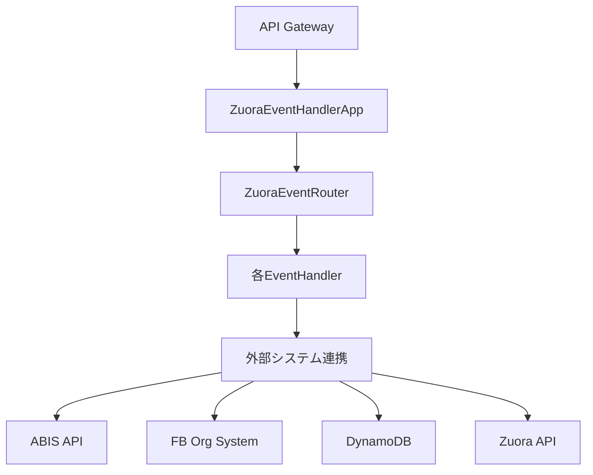

# Zuora Event Handler プロジェクト構成

## 📋 プロジェクト概要
AWS SAM（Serverless Application Model）を使用したJava Lambda関数として実装された、Zuoraイベント処理システム

---

## 🎯 メインエントリーポイント

| ファイル | 機能 |
|---------|------|
| **`ZuoraEventHandlerApp.java`** | AWS Lambdaのメイン関数。API Gatewayからのリクエストを受信し、JSONイベントを解析してルーターに渡す |
| **`ZuoraEventRouter.java`** | イベントタイプ（EventCategory）に基づいて適切なイベントハンドラーに処理を振り分ける |

---

## 🎪 イベントハンドラー群

| ファイル | 処理対象イベント | 主な機能 |
|---------|-----------------|----------|
| **`OrderCreatedEventHandler.java`** | `"Order Processed"` | Order作成時の補正処理、サブスクリプションID生成、DynamoDB保存 |
| **`OrderUpdatedEventHandler.java`** | `"Service Activation Date Updated"` | Order更新時のFB Orgへの連携処理 |
| **`RatePlanChangeEffectiveEndDateEventHandler.java`** | `"Effective End Date Scheduled Event"` | 契約期間終了時のRemoveProduct Order発行とABIS API連携 |
| **`OrderEventHandler.java`** | - | Order系イベントの共通基底クラス |
| **`ZuoraEventHandler.java`** | - | 全イベントハンドラーの共通インターフェース |

---

## 🏗️ Order構築系

| ファイル | 機能 |
|---------|------|
| **`CorrectedOrderBuilder.java`** | Zuora Orderの補正処理。標準外項目の修正、日付調整など |
| **`FBOrgCreateOrderRequestBuilder.java`** | FB Org（富士フイルム組織システム）向けのOrder作成リクエスト構築 |
| **`FBOrgCreateOrderAddProductBuilder.java`** | FB Org用の商品追加Order構築 |
| **`FBOrgCreateOrderCreateSubscriptionBuilder.java`** | FB Org用のサブスクリプション作成Order構築 |
| **`FBOrgCreateOrderUpdateProductBuilder.java`** | FB Org用の商品更新Order構築 |
| **`FBOrgOrderActionCancelSubscriptionBuilder.java`** | FB Org用のサブスクリプション解約Order構築 |
| **`FBOrgOrderActionRemoveProductBuilder.java`** | FB Org用の商品削除Order構築 |
| **`FBOrgPricingBuilder.java`** | FB Org用の価格設定構築 |

---

## 📊 データ連携・プロバイダー系

| ファイル | 機能 |
|---------|------|
| **`DynamoDbRepository.java`** | DynamoDBへのサブスクリプション情報の保存・取得 |
| **`AbisApiClient.java`** | ABIS API（手配プロセス開始システム）へのHTTPリクエスト |
| **`SubscriptionProvider.java`** | Zuora APIからのサブスクリプション情報取得 |
| **`ProductProvider.java`** | Zuora APIからの商品情報取得 |
| **`ProductRatePlanProvider.java`** | Zuora APIからの商品料金プラン情報取得 |
| **`ProductRatePlanChargeProvider.java`** | Zuora APIからの商品料金プラン課金情報取得 |

---

## 🔧 ユーティリティ・バリデーション系

| ファイル | 機能 |
|---------|------|
| **`OrderValidator.java`** | Zuora Orderの妥当性検証。料金、商品、日付などの整合性チェック |
| **`SubscriptionIdGenerator.java`** | 12桁のサブスクリプションID生成（nnnn-nnnn-nnnn形式） |
| **`RecurringClassifier.java`** | リカーリング（継続課金）商品の判定 |
| **`ValidationContext.java`** | バリデーション処理のコンテキスト情報管理 |
| **`ConstraintViolation.java`** | 制約違反情報の表現クラス |

---

## ⚙️ AWS・セキュリティ系

| ファイル | 機能 |
|---------|------|
| **`AWSSecretFetcher.java`** | AWS Secrets Managerからの機密情報取得 |
| **`AWSClientModule.java`** | AWS SDK用のクライアント（DynamoDB、Secrets Manager）提供 |
| **`SslConfig.java`** | SSL証明書設定（ローカル開発環境用） |

---

## 🔌 依存性注入・設定系

| ファイル | 機能 |
|---------|------|
| **`ProductionComponent.java`** | Dagger 2のDIコンテナ。本番環境用の依存性定義 |
| **`EventHandlersModule.java`** | イベントハンドラーのDI設定とマッピング定義 |
| **`ZuoraModule.java`** | Zuora API クライアントの設定・提供 |
| **`EnvironmentsModule.java`** | 環境変数の注入設定 |
| **`JavaNetModule.java`** | HTTPクライアント等のネットワーク系設定 |
| **`JsonModule.java`** | Jackson ObjectMapperの設定 |

---

## 📝 設定・ログ系

| ファイル | 機能 |
|---------|------|
| **`log4j2.xml`** | Log4j2のログ設定（ログレベル、出力形式など） |
| **`進捗メモ.md`** | 開発進捗の記録・タスク管理 |

---

## 🔄 処理フロー例

### 処理ステップ
1. **イベント受信**: `ZuoraEventHandlerApp` ← API Gatewayからイベント受信
2. **ルーティング**: `ZuoraEventRouter` ← EventCategoryに基づいてハンドラー選択
3. **イベント処理**: 各 `EventHandler` ← 固有のビジネスロジック実行
4. **外部連携**:
   - `AbisApiClient` → ABIS APIで手配開始
   - `FBOrgCreateOrderRequestBuilder` → FB Orgへオーダー送信
   - `DynamoDbRepository` → サブスクリプション情報保存

---

## 🛠️ 技術スタック

| 技術 | 用途 |
|------|------|
| **Java** | メイン開発言語 |
| **AWS Lambda** | サーバーレス実行環境 |
| **AWS API Gateway** | HTTPエンドポイント |
| **Dagger 2** | 依存性注入フレームワーク |
| **Jackson** | JSON処理 |
| **Log4j2** | ログ処理 |
| **JUnit** | テスト |